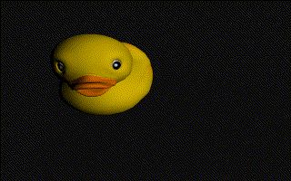

[](https://travis-ci.org/woodjazz/nsg-library)
[](https://ci.appveyor.com/project/woodjazz/nsg-library)
<a href="https://scan.coverity.com/projects/woodjazz-nsg-library">
  
</a>

---------------------------
FEATURES
---------------------------
>- Cross-platform. Currently runs on Windows, Linux, Mac OS X, Android, iOS, and HTML5 with Emscripten toolchain.
- OpenGL 2.0, OpenGL ES 2.0 or WebGL rendering.
- Scene graph.
- Keyframe animation.
- Skeletal animation (with hardware skinning).
- Point, spot and directional lights.
- Shadow mapping for all light types; cascaded shadow maps for directional lights.
- Post-processing: global and local by object.
- Events controlled by signals and slots.
- Physics (using bullet library).
- HTTP requests.
- Image loading.
- IMGUI.
- Exporter for blender files.

---------------------------
BUILDING: ALL PLATFORMS
---------------------------
Install CMake 2.8 or superior.

You need a c++11 compliant compiler.

--------------------------------
BUILDING: ANDROID (Ubuntu 14.04)
--------------------------------

sudo apt-get install openjdk-7-jdk

In order to install Android SDK:
sudo apt-get install lib32z1 lib32ncurses5 lib32bz2-1.0 lib32stdc++6

Install SDK,NDK
Set the environment variables: ANDROID_SDK, ANDROID_NDK

For the SDK you will need Android 4.4.2 (API 19)
In order to start developing applications, you must install the Platform-tools
and at least one version (API 19) of the Android platform, using the SDK Manager.
(Or run: $ANDROID_SDK/tools/android update sdk --no-ui)

Install ant (http://ant.apache.org/bindownload.cgi)
Set the environment variables: ANT_HOME

--------------------------------
BUILDING: ANDROID (Windows/OSX)
--------------------------------

Install SDK,NDK,Java(JDK 1.7)

For the SDK you will need Android 4.4.2 (API 19)

Install ant (http://ant.apache.org/bindownload.cgi)

Set the environment variables: ANDROID_SDK, ANDROID_NDK, ANT_HOME and JAVA_HOME 

IMPORTANT NOTE FOR WINDOWS' USERS: use UNIX syntax for paths when setting the environment variables. (Do not use \ use / instead)

-------------------------
BUILDING: Linux (Debian/Ubuntu)
-------------------------
apt-get install xorg-dev

apt-get install libglu1-mesa-dev

For EGL you need: sudo apt-get install libgles2-mesa-dev

You can add installed compiler as selectable alternatives with:

sudo update-alternatives --install /usr/bin/cc cc /usr/bin/clang-3.5 100

sudo update-alternatives --install /usr/bin/c++ c++ /usr/bin/clang++-3.5 100

If you have g++ and clang++ installed you can switch between them with:

sudo update-alternatives --config c++

For clang you probably will need:

apt-get install libc++-dev

Note: if you are running Linux under VMPlayer 12 then turn off OpenGL 3.3 setting the environment variable SVGA_VGPU10=0 (It will work as OpenGL 2.1.)

-------------------------
BUILDING: Emscripten
-------------------------
Install SDK: http://kripken.github.io/emscripten-site/docs/getting_started/downloads.html

Set environment variable: HOME_EMSCRIPTEN

For chrome you will need a HTTP server. For instance: python -m SimpleHTTPServer 8000

-------------------------
BUILDING: Windows
-------------------------
Install last Visual Studio

-------------------------
BUILDING: OSX/IOS
-------------------------
Install last XCode

-------------------------
Blender export
-------------------------
In order to convert .blend files to .xml you shall install blender (last version)
and define the following environment variable: BLENDER_BIN. 
BLENDER_BIN has to point to the directory where the blender executable is placed.
(See ExportBlendTool.cmake to see how cmake is looking for the blender executable)

-------------------------
Samples
-------------------------
These are some examples (from the samples folder):

- animation



```cpp
#include "NSG.h"

int NSG_MAIN(int argc, char* argv[]) {
    using namespace NSG;
    auto engine = Engine::Create();
    auto& conf = engine->GetAppConfiguration();
    conf.platform_ = AppConfiguration::Platform::UseEGL;

    PAnimationController acontrol;
    auto window = Window::Create();

    LoaderXML loader("loader");
    auto slotLoaded =
        loader.Load(Resource::GetOrCreateClass<ResourceFile>("data/duck.xml"))
            ->Connect([&]() {
                auto scene = loader.GetScene(0);
                auto objNode = scene->GetOrCreateChild<SceneNode>("LOD3sp");
                auto objPos = objNode->GetGlobalPosition();
                auto objBB = objNode->GetWorldBoundingBox();
                objBB.max_ *= 1.75f;
                objBB.min_ *= 1.75f;
                auto camera = scene->GetOrCreateChild<Camera>("camera1");
                auto control = std::make_shared<CameraControl>(camera);

                auto animation = Animation::Create("anim0");
                AnimationTrack track;
                track.node_ = camera;
                track.channelMask_ = (int)AnimationChannel::POSITION |
                                     (int)AnimationChannel::ROTATION;

                {
                    AnimationKeyFrame key(0, camera.get());
                    track.keyFrames_.push_back(key);
                }

                {
                    auto node = std::make_shared<Node>("node0");
                    node->SetParent(camera->GetParent());
                    node->SetGlobalPosition(
                        Vector3(objBB.max_.x, objBB.max_.y, 0));
                    node->SetGlobalLookAtPosition(objPos);
                    AnimationKeyFrame key(2, node.get());
                    track.keyFrames_.push_back(key);
                }

                {
                    auto node = std::make_shared<Node>("node1");
                    node->SetParent(camera->GetParent());
                    node->SetGlobalPosition(
                        Vector3(0, objBB.max_.y, objBB.min_.z));
                    node->SetGlobalLookAtPosition(objPos);
                    AnimationKeyFrame key(4, node.get());
                    track.keyFrames_.push_back(key);
                }

                {
                    auto node = std::make_shared<Node>("node2");
                    node->SetParent(camera->GetParent());
                    node->SetGlobalPosition(
                        Vector3(objBB.min_.x, objBB.max_.y, 0));
                    node->SetGlobalLookAtPosition(objPos);
                    AnimationKeyFrame key(6, node.get());
                    track.keyFrames_.push_back(key);
                }

                animation->AddTrack(track);
                animation->SetLength(8);

                acontrol = std::make_shared<AnimationController>(camera);
                acontrol->Play(animation->GetName(), false);
                window->SetScene(scene);
            });
    return engine->Run();
}
```

- momohome


```cpp
#include "NSG.h"
int NSG_MAIN(int argc, char* argv[]) {
    using namespace NSG;
    auto window = Window::Create();
    PSceneNode player;
    LoaderXML loader("loader");
    auto slotLoaded =
        loader.Load(Resource::GetOrCreateClass<ResourceFile>("data/scene.xml"))
            ->Connect([&]() {
                auto scene = loader.GetScene(0);
                auto light = scene->GetChild<Light>("Sun", false);
                static ShadowMapDebug shadowMapDebug(window, light);
                auto camera = scene->GetChild<Camera>("Camera", false);
                camera->SetWindow(window);
                static auto control = std::make_shared<CameraControl>(camera);
                static auto followCamera =
                    std::make_shared<FollowCamera>(camera);
                player = scene->GetChild<SceneNode>("RigMomo", true);
                static auto character = player->GetCharacter();
                followCamera->Track(player->GetCharacter().get(), 25);
                static float turn = 0;

                struct State : FSM::State {
                    bool loop_;
                    float time_;
                    PScene scene_;
                    PSceneNode player_;
                    PCharacter character_;
                    PAnimationController controller_;
                    const char* animName_;
                    float deltaTime_;
                    State(const char* animName, PScene scene)
                        : loop_(true), time_(0), scene_(scene),
                          animName_(animName), deltaTime_(0) {
                        player_ = scene_->GetChild<SceneNode>("RigMomo", true);
                        controller_ = player_->GetOrCreateAnimationController();
                        character_ = player_->GetCharacter();
                    }
                    void Begin() override {
                        controller_->CrossFade(animName_, loop_, 0.5f);
                    }
                    void Stay() override {
                        deltaTime_ = Engine::GetPtr()->GetDeltaTime();
                        time_ += Engine::GetPtr()->GetDeltaTime();
                    }
                    void End() override { time_ = 0; }
                };

                struct Idle : State {
                    Idle(PScene scene) : State("Momo_IdleNasty", scene) {}
                    void Stay() override {
                        State::Stay();
                        character_->SetForwardSpeed(0);
                        character_->SetAngularSpeed(0);
                    }
                } static idle(scene);

                struct Walk : State {
                    Walk(PScene scene) : State("Momo_Walk", scene) {}
                    void Stay() override {
                        State::Stay();
                        character_->SetForwardSpeed(5);
                        character_->SetAngularSpeed(90.f * turn);
                    }
                } static walk(scene);

                struct WalkBack : State {
                    WalkBack(PScene scene) : State("Momo_WalkBack", scene) {}
                    void Stay() override {
                        State::Stay();
                        character_->SetForwardSpeed(-3);
                        character_->SetAngularSpeed(90.f * turn);
                    }
                } static walkBack(scene);

                struct Run : State {
                    Run(PScene scene) : State("Momo_Run", scene) {}
                    void Stay() override {
                        State::Stay();
                        character_->SetForwardSpeed(15);
                        character_->SetAngularSpeed(90.f * turn);
                    }
                } static run(scene);

                struct TurnL : State {
                    TurnL(PScene scene) : State("Momo_Turn.R", scene) {}
                    void Stay() override {
                        State::Stay();
                        character_->SetForwardSpeed(0);
                        character_->SetAngularSpeed(90.f * turn);
                    }
                } static turnL(scene);

                struct TurnR : State {
                    TurnR(PScene scene) : State("Momo_Turn.L", scene) {}
                    void Stay() override {
                        State::Stay();
                        character_->SetForwardSpeed(0);
                        character_->SetAngularSpeed(90.f * turn);
                    }
                } static turnR(scene);

                static bool buttonA = false;
                struct Jump : State {
                    Jump(PScene scene) : State("Momo_Jump", scene) {
                        loop_ = false;
                    }
                    void Begin() override {
                        State::Begin();
                        character_->SetJumpSpeed(20);
                        buttonA = false;
                    }
                    void Stay() override {
                        State::Stay();
                        character_->SetJumpSpeed(0);
                    }
                    void End() override {
                        character_->SetJumpSpeed(0);
                        State::End();
                    }
                } static jump(scene);

                struct Glide : State {
                    Glide(PScene scene) : State("Momo_Glide", scene) {}
                    void Begin() override {
                        character_->EnableFly(true);
                        State::Begin();
                    }
                    void Stay() override {
                        State::Stay();
                        character_->SetForwardSpeed(20);
                        character_->SetAngularSpeed(90.f * turn);
                    }
                    void End() override {
                        character_->EnableFly(false);
                        State::End();
                    }
                } static glide(scene);

                struct Fall : State {
                    Fall(PScene scene) : State("Momo_FallUp", scene) {}
                    void Begin() override { State::Begin(); }
                } static fall(scene);

                static auto IsFalling = [&]() {
                    return character->IsFalling();
                };

                static float speed = 0;
                static FSM::Machine fsm(idle);
                idle.AddTransition(walk).When([&]() { return speed > 0; });
                idle.AddTransition(walkBack).When([&]() { return speed < 0; });
                idle.AddTransition(turnL).When([&]() { return turn < 0; });
                idle.AddTransition(turnR).When([&]() { return turn > 0; });
                idle.AddTransition(jump).When([&]() { return buttonA; });
                idle.AddTransition(fall).When([&]() { return IsFalling(); });
                jump.AddTransition(fall).When([&]() { return IsFalling(); });
                jump.AddTransition(glide).When([&]() { return buttonA; });
                fall.AddTransition(idle).When([&]() { return !IsFalling(); });
                fall.AddTransition(glide).When([&]() { return buttonA; });
                glide.AddTransition(fall).When([&]() { return !buttonA; });
                turnL.AddTransition(idle).When([&]() { return turn == 0; });
                turnL.AddTransition(turnR).When([&]() { return turn > 0; });
                turnL.AddTransition(walk).When([&]() { return speed > 0; });
                turnR.AddTransition(idle).When([&]() { return turn == 0; });
                turnR.AddTransition(turnL).When([&]() { return turn < 0; });
                turnR.AddTransition(walk).When([&]() { return speed > 0; });
                walk.AddTransition(run).When(
                    [&]() { return speed > 0 && walk.time_ > 1.3f; });
                walk.AddTransition(idle).When(
                    [&]() { return speed == 0 && walk.time_ > 1; });
                walk.AddTransition(idle).When([&]() { return speed < 0; });
                walk.AddTransition(jump).When([&]() { return buttonA; });
                walkBack.AddTransition(idle).When([&]() { return speed >= 0; });
                run.AddTransition(walk).When(
                    [&]() { return speed == 0 && run.time_ > 1; });
                run.AddTransition(jump).When([&]() { return buttonA; });
                window->SetScene(scene);
                fsm.Go();

                static auto playerControl =
                    std::make_shared<PlayerControl>(window);

                static auto slotMoved =
                    playerControl->SigMoved()->Connect([&](float x, float y) {
                        speed = y;
                        turn = x;
                    });

                static auto slotStick =
                    playerControl->SigLeftStickMoved()->Connect(
                        [&](float x, float y) {
                            speed = y;
                            turn = x;
                        });

                static auto slotButtonA = playerControl->SigButtonA()->Connect(
                    [&](bool pressed) { buttonA = pressed; });

            });

    auto scene = std::make_shared<Scene>();
    auto font = std::make_shared<FontXMLAtlas>();
    auto loadingNode = scene->CreateChild<SceneNode>();
    auto loadingMaterial = Material::Create();
    font->SetXML(
        Resource::GetOrCreate<ResourceFile>("data/AnonymousPro32.xml"));
    auto atlasTexture = std::make_shared<Texture2D>(
        Resource::GetOrCreate<ResourceFile>("data/AnonymousPro32.png"));
    font->SetTexture(atlasTexture);
    auto camera = scene->CreateChild<Camera>();
    camera->SetPosition(Vector3(0, 0, 1));
    camera->EnableOrtho();
    loadingNode->SetMesh(font->GetOrCreateMesh("Loading...", CENTER_ALIGNMENT,
                                               MIDDLE_ALIGNMENT));
    loadingMaterial->SetFontAtlas(font);
    loadingNode->SetMaterial(loadingMaterial);
    window->SetScene(scene);
    auto engine = Engine::Create();
    return engine->Run();
}
```

- planet *(See code in samples directory)*


